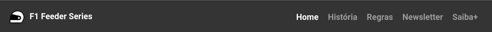

<h1 align="center">

</h1>

<h1 align="center">
HEADER EM HTML/CSS (MODELO DE README)
</h1>

**Projeto:** Entrega do trainee <!-- projeto em que projeto o requisito foi implementado)-->

**Desenvolvedor(es):** Gustavo Gimenez e Guilherme Salles <!--densenvolvedor(es) que implementataram o requisito-->

**Data:** 31/08/2021 <!--data do registro da implementação-->

---

# Indice
- [Descrição](#-descrição)
- [Implementação](#-implementação)
- [Documentação](#-documentacao)
- [Contato para dúvidas](#-contato-para-dúvidas)

---

## 🖊️ **Descrição** 

**Ferramentas utilizadas:** HTML, CSS e Bootstrap <!--tecnologias utilizadas na implementação do requisito-->

**Dificuldade de implementação:** 6/10 <!--dificuldade de 0 a 10, sendo 0 extramamente fácil e 10 extramamente difícil-->

**Tempo para implementação:** 5 horas <!--tempo gasto para implementação do requisito-->

**Preço cobrado:** R$100,00 <!--preço cobrado do cliente pelo requisito-->

<!--Aqui você colocará um texto descrevendo o requisito e uma imagem do mesmo-->
O header se trata do cabeçalho feito para o site F1 Feeder Series, projeto para a entrega final do trainee, consiste em uma imagem na esquerda que leva a home e um menu na direita com botões que encaminham para as outras páginas do site, como pode ser visto na imagem a seguir:

---

## 👨‍💻 **Implementação**

<!--Nessa seção, será descrita o passo a passo da implementação do requisito, você deve escrever todos os passos que julga necessário para que alguém consigo realizar a implementação consultando este documento-->

**Passo 1:** Para a implementação do header, iniciamos colocando a tag header no html e uma classe

**Passo 2:** Depois utilizamos a classe definida no passo 1 para definir seu tamanho no CSS

**Passo 3:** ...

---

## 📄 **Documentação**

<!--Aqui ficará toda documentação utilizada para implementação do requisito, seja vídeo, texto, artigo, etc.-->

- HTML: https://www.w3schools.com/tags/tag_header.asp

- Bootstrap: https://getbootstrap.com/docs/4.1/components/navbar/

- Curso Origamid: https://www.origamid.com/curso/web-design-completo/

- Curso Bootstrap: https://www.youtube.com/watch?v=SmQMZ36hJJY&list=PLnDvRpP8Bnexu5wvxogy6N49_S5Xk8Cze

---

## 📞 **Contato para dúvidas**

**Telefone:** (99) 999999999 <!--Telefone do dev responsável pela implementação-->

**Email:** gimenez.dogbelga@gmail.com <!--Email do dev resposável pela implementação-->