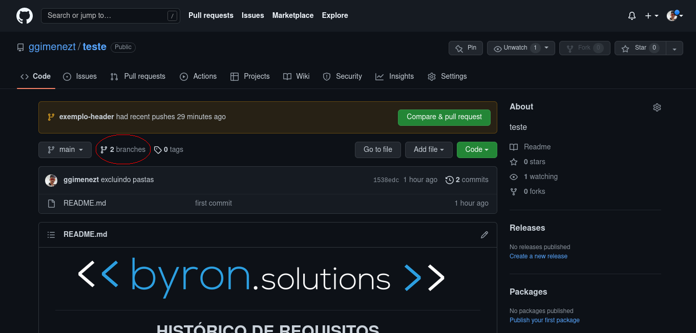
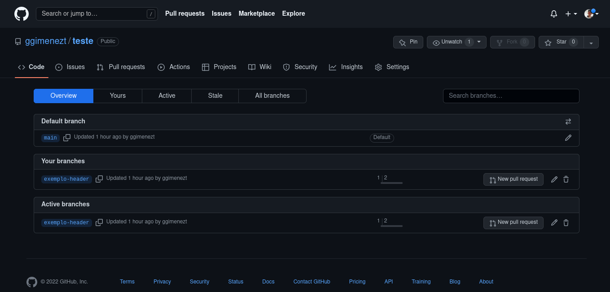
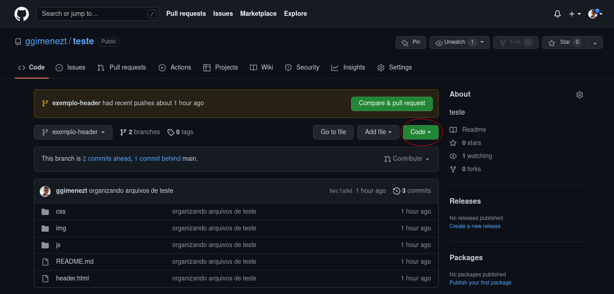
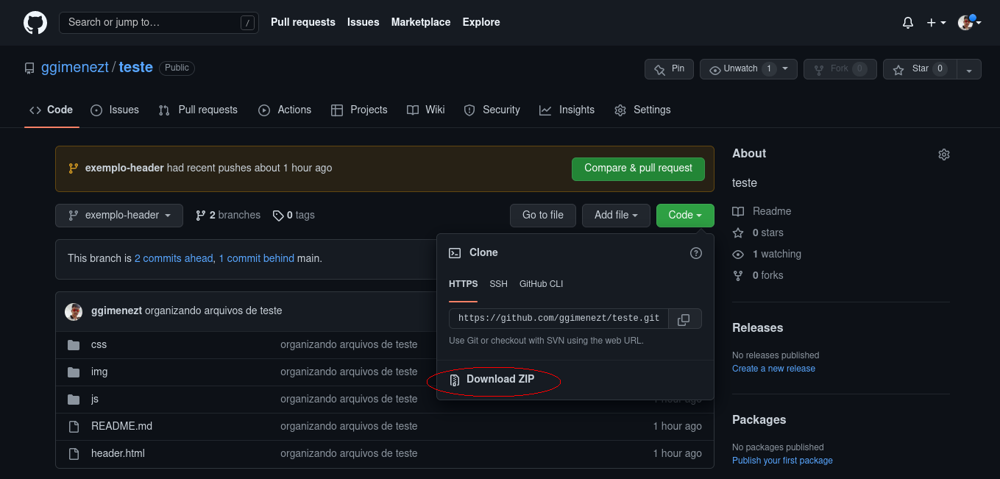
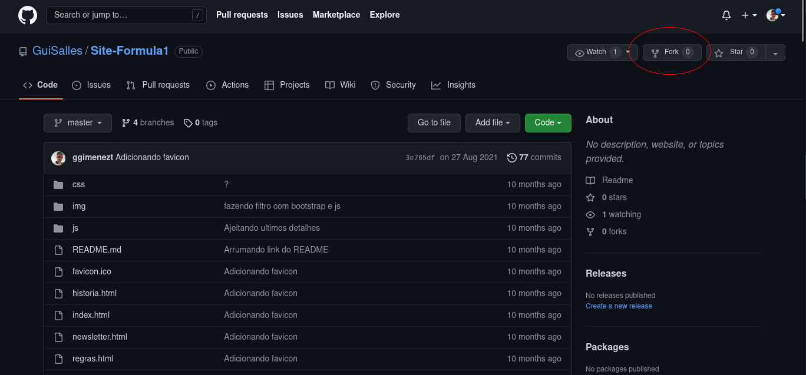

<h1 align="center">

</h1>

<h1 align="center">
HISTÓRICO DE REQUISITOS
</h1>

#  Indice 

- [Sobre](#-sobre)
- [Como encontrar um requisito](#-como-encontrar-um-requisito)
- [Como baixar um requisito](#-como-baixar-um-requisito)
- [Como adicionar um requisito](#-como-adicionar-um-requisito)
- [Dúvidas](#-dúvidas)

---

## ❓ Sobre
Bem vindos ao repositório de históricos de requisitos da byron 🥳

Aqui ficarão registrados todos os requisitos diferentes que foram implementados pelos desenvolvedores da byron durante a execução dos projetos, como aquele carousel mais difícil de colocar no site ou aquele login com redes sociais com tutorial só em hebraico.

Logo abaixo você encontrará explicações de como encontrar um requisito que está procurando, baixar esse requisito ou adicionar um requisito que você queira aqui no repositório.

Aproveitem e usem sem moderação 😁


---

## 🔎 Como encontrar um requisito

Para encontrar um requisito é muito simples, cada um está em uma branch especifica do nosso repositório, e logo na página inicial você encontrará o seguinte botão para acessar a lista de branchs:



O botão te encaminhara para a seguinte página:



Você verá que as branchs estão nomeadas de formas especificas:
**"tecnologia-nome_do_requisito"**

Portanto basta procurar pelo nome da tecnologia do requisito que está buscando e depois pelo nome do mesmo

Quando encontrar, clique no nome do mesmo para acessar a branch e realizar o download 😀

Caso o requisito não esteja lá ele ainda não foi registrado e infelizmente você terá de procurar em outro lugar pela internet, mas depois de implementar não se esqueça de voltar aqui para registra-lo  💙

---

## 📁 Como baixar um requisito

Exitem 2 formas simples de baixarmos os requisitos, pela inteface do GitHub e pelo terminal, vamos aprender as duas aqui :D

**1. Pela Interface do GitHub:**

1.1. O primeiro passo é encontrar o requisito que deseja, caso precise de ajuda, temos um tópico logo acima explicando como encontrar requisitos.

1.2. Clique no botão de code, o botão abrirá um menu no qual disponibilizará o downloand para você, como indicado nas imagens abaixo:





**2. Pelo Terminal:**

2.1. Acesse a pasta do seu computador na qual deseja que o requisito seja baixado

2.2. Utilize o comando git clone para clonar a branch para seu repositório.

```
$ cd <path da pasta no qual deseja deseja baixar o requisito>

$ git clone -b <nome-da-branch> <url-do-repositório-de-requisitos> 
```
---

## 📦 Como adicionar um requisito

1. Faça um fork do repositório de requisitos para o seu GitHub.



2. Utilize o comando git clone para clonar o fork que você realizou para sua máquina.

```
$ cd <path da pasta no qual deseja criar o clone do repositório>

$ git clone <url-do-seu-fork> 
```

3. Adicione o requisito no repositório local e de o push para o repositório remoto que você gerou com o fork.

```
$ git add .

$ git commit -m "mensagem"

$ git push origin main/master
```

4. Peça para um dos responsáveis pela administração do repositório criar a branch do seu requisito.

5. Faça o pull request para o repositório selecionando a branch criada para o seu requisito.

Imagens do pull request.

6. Agora é com nós de DPJ, analisaremos e aceitaremos seu requisito no repositório 😀

---

## 🤔 Dúvidas
Qualquer dúvida contate um membro de DPJ :D

---